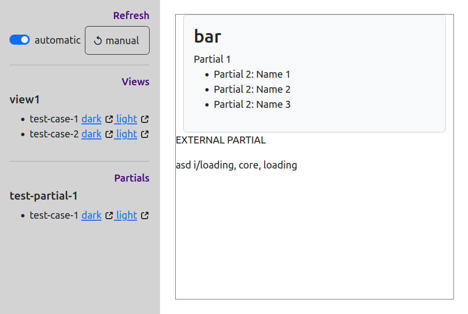

# Mustache Preview System with NodeJS

A simple preview system for Mustache templates, inspired by
[StorybookJS](https://storybook.js.org/). The templates are rendered with a set
of preview data objects.



## Features

- auto-reload on template or preview data change
- multiple "layouts" to support different themes
- can preview views and partials
- supports Mustache helpers (uses with [Handlebars](https://handlebarsjs.com/)
  under the hood)
- display preview in a preview box or new window

## Requirements

You need a modern NodeJS version (>= 20).

## Installation

- Install `mustache-preview` as a dev dependency. (`npm install -D mustache-preview`).

## Concepts

## How to use it

- Create Mustache templates in the `views` directory. (need a `.mustache` extension)
- Create Mustache partials in the `views/partials` directory. (need a `.mustache` extension)
- Create test data in JSON files: `test-data/<VIEW>/<TESTCASENAME>.json`, e.g. `test-data/my-view/logged-off.json`. There's one JSON file per test case.
- Create static files (resources like CSS, images, etc.) in the `public` directory.
- Create layouts in the `layouts` directory. Layouts can be used to add global CSS stylesheets, JavaScript libraries or surrounding HTML elements, e.g. to indicate that certain themes (contrast mode etc.) are active. Each view and partial can be previewed for each layout.
- Create a preview configuration `preview.config.mjs` (see below).
- Run `npx mustache-preview` and open [`http://localhost:3000`](http://localhost:3000) in your browser.

Check out the minimal [demo project](https://github.com/sr258/mustache-preview-demo).

## Parameters

- `-c <CONFIG_FILE>`, `--config <CONFIG_FILE>` a custom configuration filename
- `-p <PORT>`, `--port <PORT>` a custom port

## Configuration

All paths are relative to the current working directory when running `npx mustache-preview`.

```js
export default {
  paths: {
    views: "views",
    partials: [
      {
        dir: "views/partials",
      },
      {
        dir: "external-partials",
        namespace: "external/namespace",
      },
    ],
    /* 
    also possible:
    partials: "views/partials"
    */
    public: "public",
    "test-data": "test-data",
    layouts: "layouts",
  },
  /* You can also add helper mock implementations that can be used in the templates */
  helpers: {
    str: (content) => content.fn(this),
    quote: (content) => content.fn(this),
    pix: (content) => content.fn(this),
    userdate: (content) => content.fn(this),
    shortentext: (content) => content.fn(this),
  },
};
```
